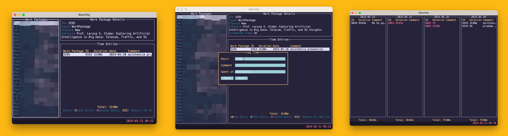

# lazyop



`lazyop` is a command line tool that allows you to interact with [OpenProject](https://www.openproject.org) from the terminal.

It does not support all the features of OpenProject (nor does it intend to), but it is a good starting point:

* View open work packages assigned to you.
* Create/Read/Update/Delete time entries (logged time).

## Setup

To configure `lazyop`, create a configuration file in `~/.config/lazyop/config.json` or your current working directory
with the following content:

```go
{
    "base_url": "https://your.openproject.url/api/v3/",
    "user_id": 0, // your OpenProject user ID, which can be found on your profile page URL
    "api_key": "your-api-key" // this can be generated from your OpenProject account settings
}
```

## Build

Build the project with the following command:

```bash
go build
```

Alternatively build it as a Docker image with:

```bash
docker build . -t benhid/lazyop
```
## Run

Run from your terminal with the following command:

```bash
lazyop
```

Or using the Docker image:

```bash
docker run -it -v $(pwd)/config.json:/config.json benhid/lazyop
```
